# 「天文月報」2026年XX月号掲載の追悼文集へのAPPENDIX

紙数の制約のために，本文では図表などを割愛した．
本文掲載のものも含め，図表をこのページに掲載する．

## 追悼　谷川清隆	平井正則（福岡教育大学名誉教授）
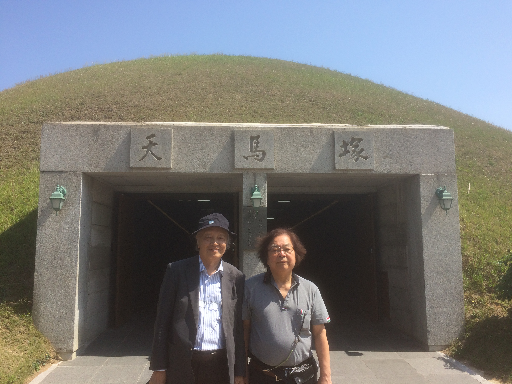

## 緯度観測所  〜国立天文台地球回転研究系のころの谷川さんとの思い出  里　嘉千茂（東京学芸大学名誉教授）
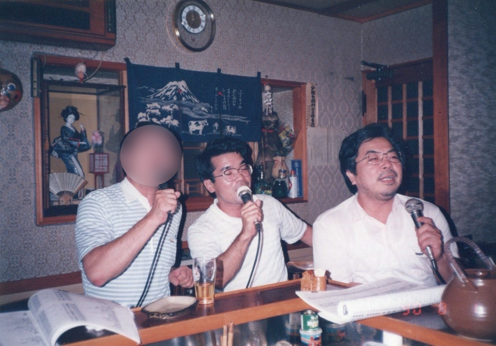

## 谷川さんの思い出	真鍋盛二（国立天文台電波研究部）
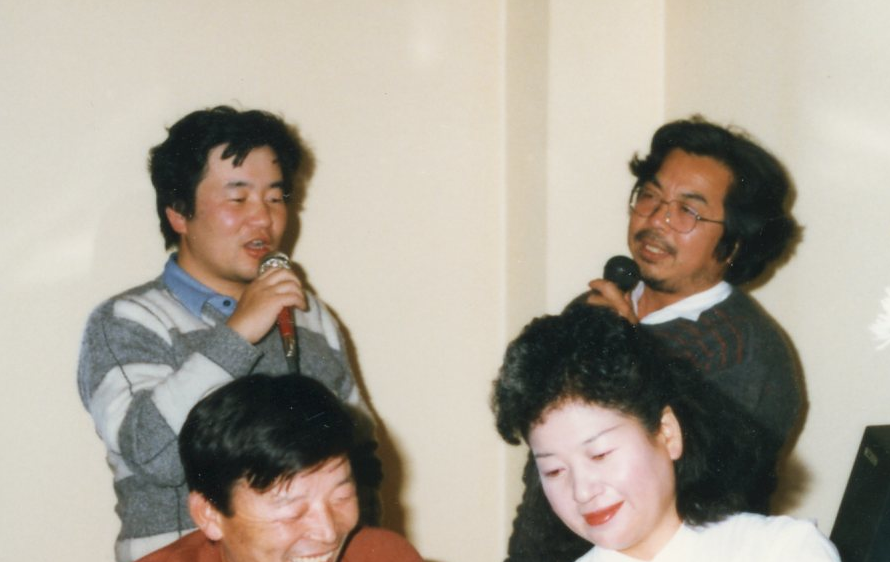

## わが友谷川君	木下宙（元国立天文台位置天文・天体力学研究系教授）　    
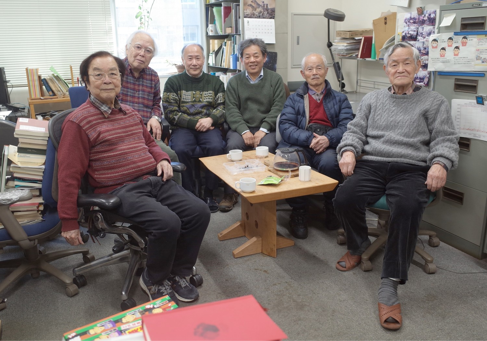

## 谷川さんと推古日食	相馬充（国立天文台），早川尚志（名古屋大学）　    
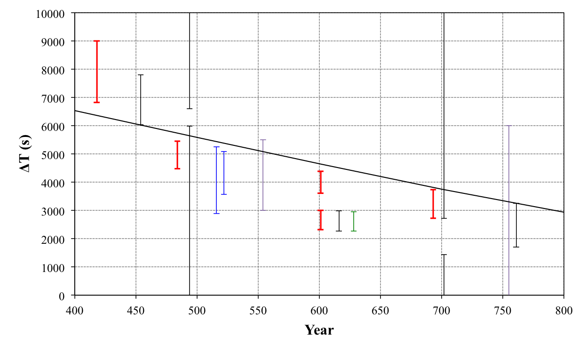

筆者による推古日食のΔT拘束幅（緑）とその他の研究成果の比較．
黒がMorrison et al. (2021), 青がSoma & Tanikawa (2016), 紫が Martinez Uso & Marco Castillo (2019)，
赤がHayakawa et al. (2022)のΔT拘束点。Hayakawa, Murata & Soma (2022) に基づき，早川作成．

## The TANIKAWA PHENOMENON. 	Prof. Friday B. Sigalo（ナイジェリア・リバーズ州立大学）
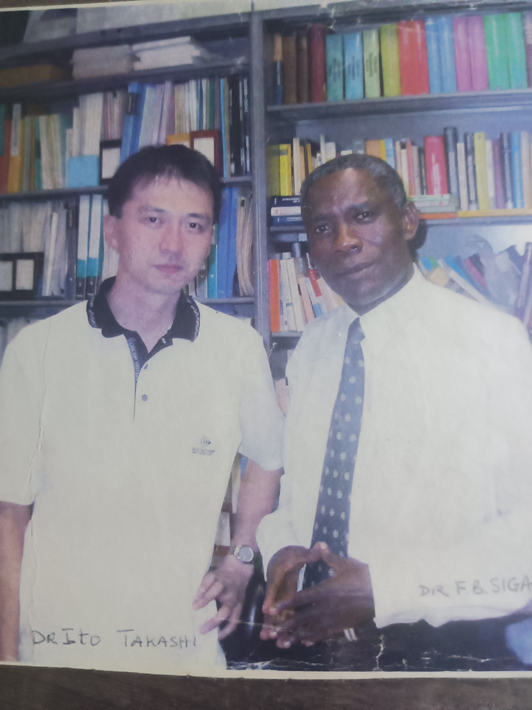
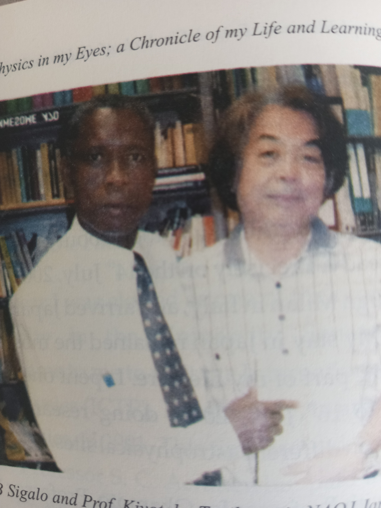
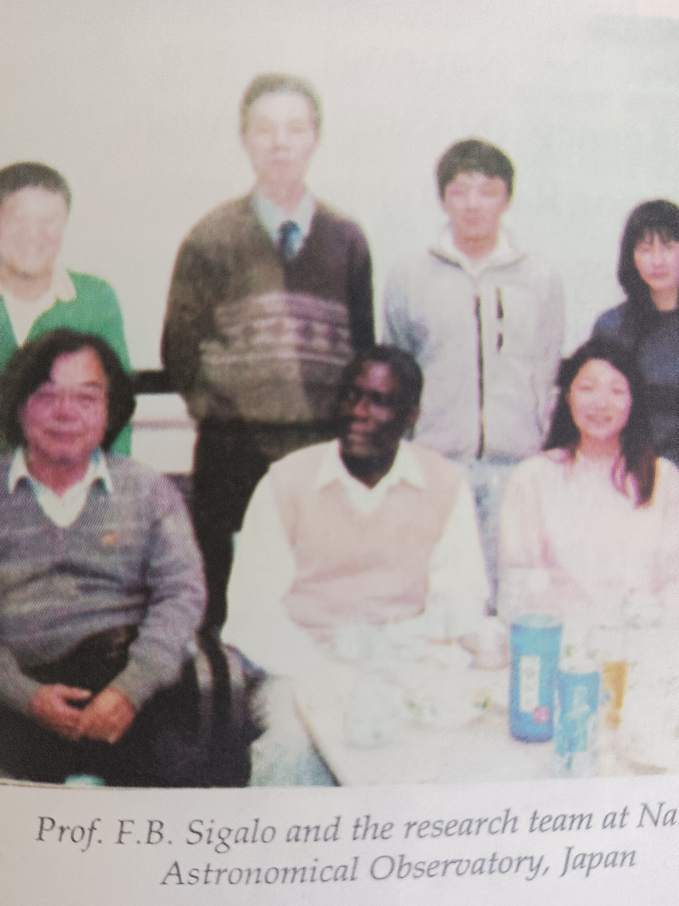
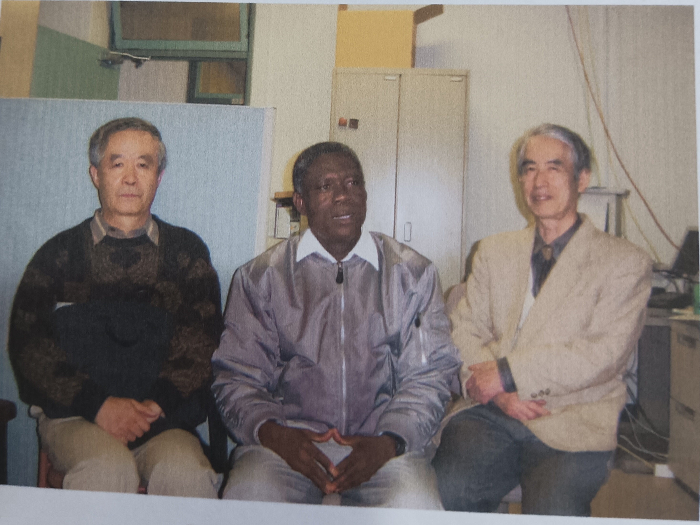

## 谷川清隆さんの思い出	伊藤孝士(国立天文台)
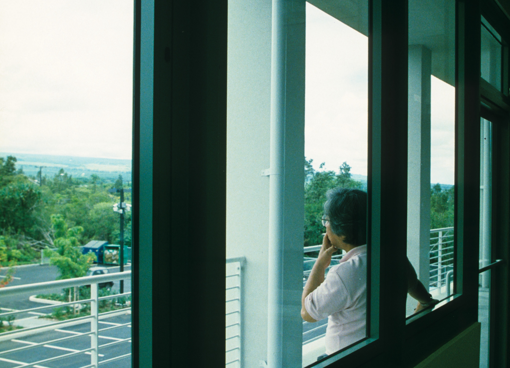

## 谷川先生との思い出	斎藤正也(長崎県立大学シーボルト校)
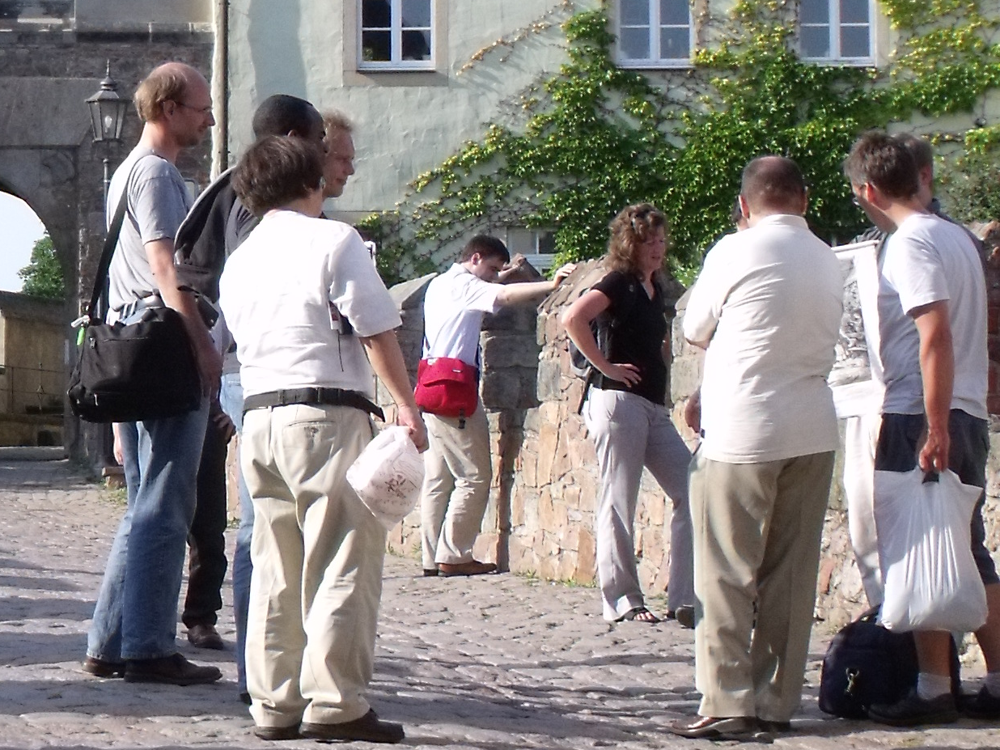
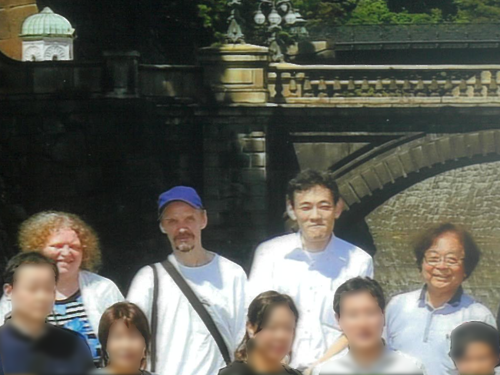

